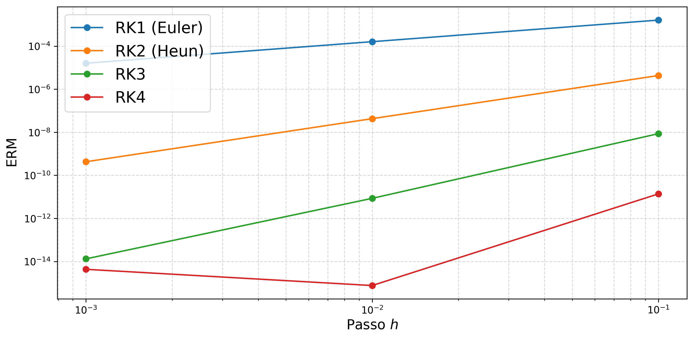
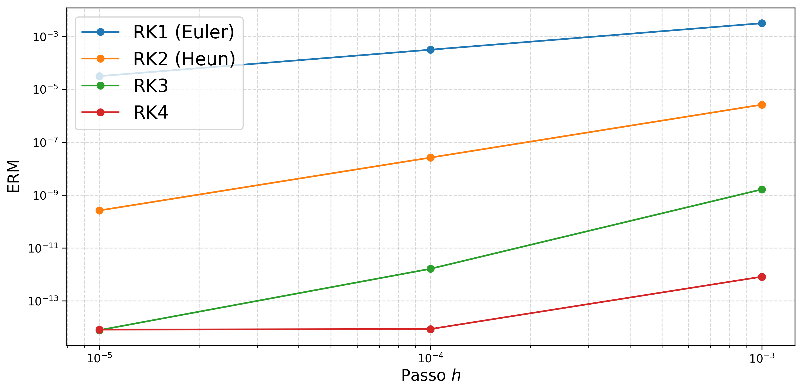
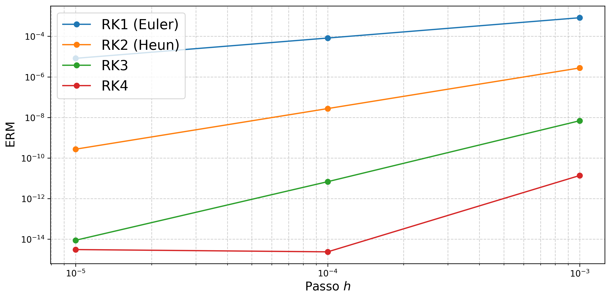
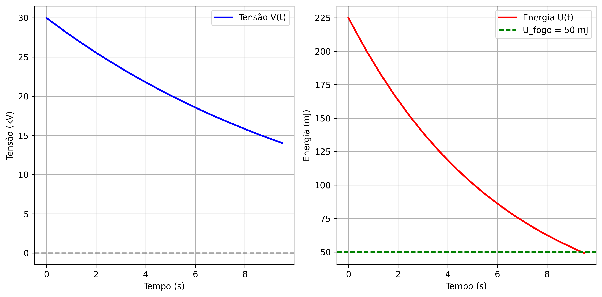
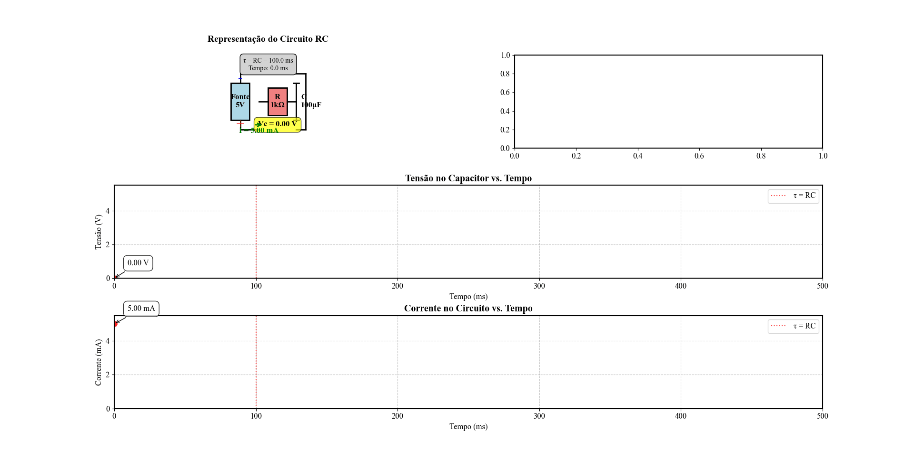

# ⚡ Circuito Solver + Métodos de Runge-Kutta

## 📌 Descrição

Este projeto investiga o fenômeno de eletrização de um automóvel em movimento causado pelo atrito com o solo, modelando o sistema como um circuito elétrico do tipo **Resistor-Capacitor (RC)**.

Durante o movimento, o veículo acumula carga elétrica e, ao parar, essa carga é dissipada pelos pneus. Caso a descarga não seja completa, pode ocorrer uma centelha capaz de inflamar combustível.

O problema é descrito por uma **Equação Diferencial Ordinária (EDO)** de primeira ordem, cuja solução é obtida por métodos numéricos de **Runge-Kutta (RK1 a RK4)**.

---

## 🎯 Objetivos

- Modelar a descarga elétrica do veículo como circuito RC  
- Aplicar métodos de Runge-Kutta (RK1 a RK4)  
- Comparar soluções numéricas com a solução analítica  
- Avaliar o erro relativo dos métodos  
- Determinar o tempo seguro para evitar ignição (U < 50 mJ)

---

## ⚙️ Modelo Matemático

\[
\frac{dV}{dt} = -\frac{V}{R_{eq}C}
\]

\[
V(t) = V_0 e^{-t/(R_{eq}C)}
\]

\[
U(t) = \frac{1}{2} C V(t)^2
\]

---

## 🔬 Parâmetros do Sistema

| Parâmetro | Valor |
|----------|------|
| Tensão inicial (V₀) | 30 kV |
| Capacitância (C) | 500 pF |
| Resistência dos pneus (R) | 100 GΩ |
| Resistência equivalente (R_eq) | R / 4 |
| Energia crítica (U_fogo) | 50 mJ |

---

## 🧪 Métodos Numéricos Utilizados

- Euler (RK1)  
- Heun (RK2)  
- Runge-Kutta de 3ª ordem (RK3)  
- Runge-Kutta de 4ª ordem (RK4)

---

## 📊 Resultados

### 🔹 Tensão ao longo do tempo


### 🔹 Comparação entre métodos RK


### 🔹 Energia armazenada


### 🔹 Tensão × Energia


---

## 🎞️ Simulação do Circuito RC



---

## 🚀 Como executar

```bash
git clone https://github.com/deepwebd3/TCC---C-DIGOS.git
cd TCC---C-DIGOS

# Criar ambiente virtual
python -m venv .venv

# Ativar (Windows PowerShell)
.venv\Scripts\Activate.ps1

# Instalar dependências
pip install -r requirements.txt

# Executar simulação
python TCC_CODIGOS/EX3.py